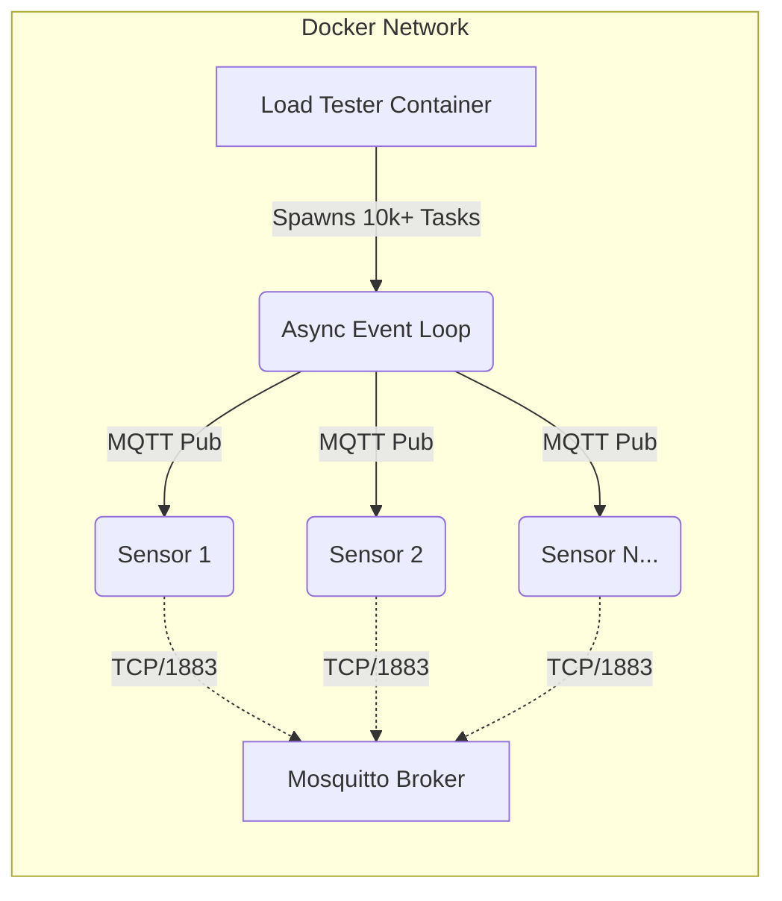

# IoT Sensor Load Tester

> **A high-throughput, asynchronous simulator for IoT infrastructure stress testing.**


##  Overview

Testing IoT Brokers (like Mosquitto, EMQX, or HiveMQ) requires more than just sending data; it demands maintaining **thousands of concurrent open connections**.

Standard multi-threading struggles at this scale due to OS context-switching overhead. This project leverages **Python's AsyncIO** to spawn thousands of lightweight tasks, allowing a single container to simulate **10,000+ sensors** with minimal CPU and RAM usage.

### Key Features

-   **High Concurrency:** Simulates thousands of devices on a single thread.
-   **Dockerized Stack:** Full environment (Broker + Load Tester) setup in one command.
-   **Real-time Telemetry:** Generates varied data (Temperature, Vibration, Pressure).
-   **12-Factor App:** Configuration via Environment Variables for easy deployment.

##  Architecture

The solution is containerized for portability and scalability. The `Load Tester` container spawns virtual sensors that operate independently within an async event loop, pushing JSON payloads to the MQTT Broker over an internal Docker network.



##  Quick Start (Docker)

The recommended way to run the simulation is with **Docker Compose**. This ensures the environment is correctly configured for high-concurrency networking.

### 1. Run the Simulation

This command builds the Python image and starts both the MQTT Broker and the Load Tester.

```bash
docker-compose up --build
```

### 2. Verify Data Flow

In a new terminal, subscribe to the MQTT topic to see the data flowing from the simulated sensors.

```bash
# Subscribe to the topic inside the broker container
docker exec -it iot-sensor-load-tester-mqtt-broker-1 mosquitto_sub -t "sensors/telemetry" -v
```

### 3. Stop & Clean Up

```bash
docker-compose down
```

---

##  Configuration

The application follows **12-Factor App** principles. All configuration is managed through environment variables set in the `docker-compose.yml` file. No code changes are needed to adjust simulation parameters.

| Variable           | Default       | Description                                        |
| ------------------ | ------------- | -------------------------------------------------- |
| `MQTT_BROKER`      | `mqtt-broker` | Hostname of the MQTT Broker (Docker service name). |
| `MQTT_PORT`        | `1883`        | TCP Port for the broker.                           |
| `NUM_SENSORS`      | `1000`        | Number of concurrent virtual sensors to spawn.     |
| `INTERVAL_SECONDS` | `5.0`         | Data transmission frequency per sensor.            |
| `BATCH_SIZE`       | `500`         | Ramp-up batch size to prevent CPU spikes on start. |

**Example `docker-compose.yml` Tweak:**

To simulate 5,000 devices sending data every second, modify the `environment` section:

```yaml
services:
  load-tester:
    environment:
      - MQTT_BROKER=mqtt-broker
      - NUM_SENSORS=5000       # Simulating 5k devices
      - INTERVAL_SECONDS=1.0   # Sending data every second
```

---

##  Local Development (Without Docker)

If you prefer to run the script locally for development or debugging, ensure you have **Python 3.10+**.

**⚠️ Windows Users:** Python 3.13+ on Windows has known issues with high-volume AsyncIO networking. Using Docker is recommended for stability.

1.  **Set Up Virtual Environment**
    ```bash
    python -m venv venv
    source venv/bin/activate  # On Windows: .\venv\Scripts\activate
    pip install -r requirements.txt
    ```

2.  **Run the MQTT Broker**
    A broker is still required. You can start one easily with Docker.
    ```bash
    docker-compose up -d mqtt-broker
    ```

3.  **Run the Script**
    Set the environment variables and run the main script.
    ```bash
    # Example for Linux/macOS
    MQTT_BROKER=localhost NUM_SENSORS=100 python src/main.py
    ```

##  Project Structure

```text
.
├── docker-compose.yml    # Defines and orchestrates the services
├── Dockerfile            # Defines the Python application image
├── requirements.txt      # Python dependencies
├── src/
│   ├── main.py           # Application entry point and async orchestrator
│   └── config.py         # Environment variable loader
└── mosquitto/
    └── config/           # MQTT Broker configuration
```

##  Performance Notes

-   **Memory:** Consumes approximately 50MB of RAM per 1,000 sensors.
-   **CPU:** A single core can handle ~10,000 concurrent sensors sending data every 5 seconds.
-   **OS Limits:** When running locally (outside Docker) with a high sensor count (>10k), you may encounter OS file descriptor limits (`ulimit -n`). Docker environments are typically pre-configured with higher limits.

---

*This project was developed for educational purposes in Software Engineering and distributed systems architecture.*
