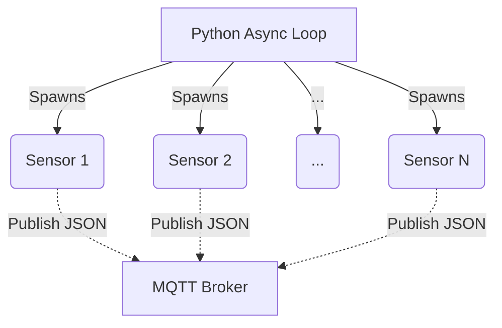

# IoT Sensor Load Tester

A high-throughput simulator for IoT infrastructure, designed to stress-test MQTT brokers by simulating thousands of concurrent devices sending data.


## Overview

Many systems fail not due to data volume, but due to the sheer **number of simultaneous connections**. Simulating 10,000 sensors using conventional threading would consume gigabytes of RAM and lead to excessive CPU context switching.

This project leverages **AsyncIO** to overcome this challenge. By using asynchronous programming, it can maintain thousands of open connections on a single thread, focusing the stress on the network and the MQTT broker, not on the machine running the test.

## Architecture

The script generates "virtual sensors" that operate independently. Each sensor connects to an MQTT broker and periodically publishes a JSON payload with real-time generated fake telemetry data.



## Getting Started

### 1. Environment Setup

It is highly recommended to use a virtual environment.

**Windows:**
```bash
python -m venv venv
.\venv\Scripts\activate
```

**Linux / macOS:**
```bash
python3 -m venv venv
source venv/bin/activate
```

### 2. Install Dependencies

Install the required libraries using pip:
```bash
pip install aiomqtt faker
```

### 3. Start MQTT Broker (Optional)

If you don't have a remote MQTT broker, you can run one locally using Docker:
```bash
docker-compose up -d
```

### 4. Run the Test

Execute the main script to start the simulation:
```bash
python src/main.py
```

## Configuration

To customize the simulation parameters, edit the `src/config.py` file:

```python
# src/config.py

MQTT_BROKER = "localhost"
NUM_SENSORS = 10000       # Note: High values may require OS-level tuning (e.g., ulimit)
INTERVAL_SECONDS = 5.0    # Publishing frequency in seconds
```

---

*This project was developed for educational purposes in Software Engineering and distributed systems architecture.*